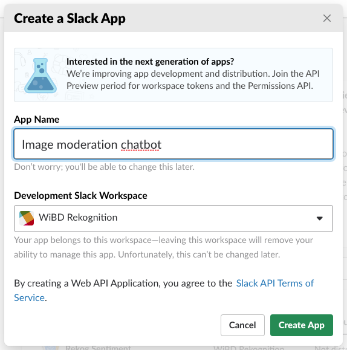
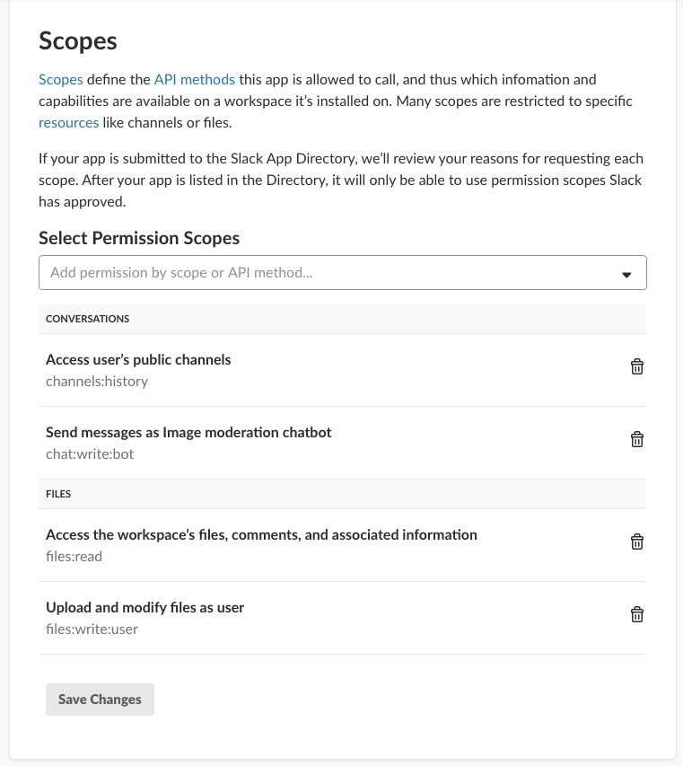
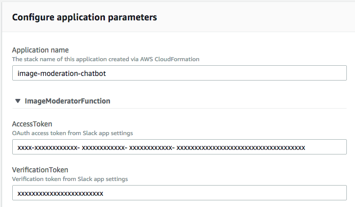
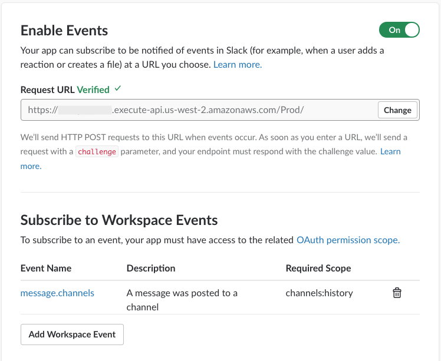
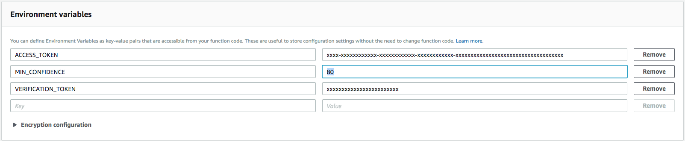

# Introduction to Amazon Rekognition with Social Media Image Moderator

[Amazon Rekognition](https://aws.amazon.com/rekognition/), a deep learning-based service, makes it easy to add image and video analysis
to your applications. Explore Rekognition features and build a Social Media Image Moderator in this walk-through. Begin by exploring Rekognition's face detection and comparison capabilities. Next, use the [Detect Unsafe Images API](https://docs.aws.amazon.com/rekognition/latest/dg/procedure-moderate-images.html) to detect and remove suggestive content as its being uploaded into social media by building an Image Moderator.

This example is based on robperc's Serverless Reference Architecture: Image Moderation Chatbot repository here: https://github.com/aws-samples/lambda-refarch-image-moderation-chatbot

Rekognition can identify images that contain suggestive or explicit content, helping administrators of photo sharing sites, forums, e-commerce platforms and more protect their users. Image moderation provides a hierarchical list of labels for each image with confidence scores to enable fine-grained control over what images to allow. In this example, images found to contain explicit or suggestive content labels above a minimum confidence interval are automatically removed by a Slack chatbot, and a message explaining the removal is posted to the originating channel. The reference architecture presented here uses [Amazon API Gateway](https://aws.amazon.com/api-gateway/), [AWS Lambda](https://aws.amazon.com/lambda/), and [Amazon Rekognition](https://aws.amazon.com/rekognition/)'s [image moderation](https://aws.amazon.com/rekognition/faqs/#image-moderation) to create a [Serverless](https://aws.amazon.com/serverless/#getstarted) workflow for protecting a user's social media channel. This example is intended to work with [Slack](https://slack.com/) using a chatbot, but could also be modified to work with other popular social media or chat apps such as [Facebook Messenger](https://www.messenger.com/).

This repository contains sample code for all the Lambda functions depicted in the diagram below as well as an [AWS CloudFormation](https://aws.amazon.com/cloudformation/) template for creating the functions and related resources.

For further ideas applying Amazon Rekognition features to social media check out [Finding Missing Persons using Social Media and Rekognition](https://github.com/aws-samples/finding-missing-persons-using-social-media-and-amazon-rekognition) and [Image Recognition and Processing Backend Serverless reference architecture](https://github.com/awslabs/lambda-refarch-imagerecognition)

## Rekognition Introduction
1. Sign in to your AWS account.
1. Get familiar with the facial detection features of Rekognition by completing the following tutorial:
https://aws.amazon.com/getting-started/tutorials/detect-analyze-compare-faces-rekognition/
1. While in the Rekognition page of the AWS Management Console, note the additional demos provided. Test out these demos, now, or at a later time. Use your own images, or try images from the links at the bottom of the section.
1. Choose the Image Moderation demo by clicking on 'Image Moderation' under 'Demos'
1. Analyze the sample images. Note the JSON Response for the swimwear image and the confidence level of over 90%.

* [Cliffs](https://s3-us-west-2.amazonaws.com/wibd/wibdrekognition/cliffs.jpg)
* [Villa](https://s3-us-west-2.amazonaws.com/wibd/wibdrekognition/villa.jpg)
* [Dog](https://s3-us-west-2.amazonaws.com/wibd/wibdrekognition/dog2.jpg)
* [Start Sign](https://s3-us-west-2.amazonaws.com/wibd/wibdrekognition/startsign.jpg)

## Image Moderator
Now build the Image Moderator. This example uses a Slack chatbot and AWS Lambda to call the Rekognition Detect Unsafe Images API. The architecture is explained below.

1. A user posts a message containing an image to a chat app channel that’s monitored by a chatbot.
1. The chat app posts the event to an Amazon API Gateway API for the chatbot.
1. The chatbot validates the event. This event triggers an AWS Lambda function that downloads the image.
1. Amazon Rekognition’s image moderation feature checks the image for suggestive or explicit content.
1. The chat app API deletes an image containing explicit or suggestive content from the chat channel.
1. The chatbot uses the chat app API to post a message to the chat channel detailing deletion of the image.

## Running the Example
### Preparing Slack
First make sure you're logged in to Slack, then follow these instructions to prep your bot:
1. [Create an app](https://api.slack.com/apps?new_app=1) ([Documentation](https://api.slack.com/slack-apps#creating_apps)). Add the App to your Workspace. If you don't have Workspace, create one [here](https://slack.com/create).
1. From the `Basic Information` tab under `Settings` take note of the `Verification Token` as it will be required later
1. Navigate to the `OAuth & Permissions` tab under `Features`
1. Under the `Scopes` section add the following permission scopes
    * Under 'Conversations', 'Access users public channels; channels:history'
    * Under 'Conversations', 'Send Messages as [your app name]; chat:write:bot'
    * Under 'Files', 'Access the workspace's files, comments, and associated information; files:read'
    * Under 'Files', 'Upload and modify files as user; files:write:user'

    
1. Click `Save Changes`
1. Scroll to the top of the page and Click `Install App to Workspace` then `Authorize`. Read and acknowledge warning messages, if you are presented one.
1. Note the `OAuth Access Token` as it will be required later

### Launching the Bot Backend on AWS

#### Launch from Serverless Application Repository
The AWS services needed for the bot have been defined in a Serverless Applictaion Model (SAM) template and can be launched from the [Serverless Application Repository](https://aws.amazon.com/serverless/serverlessrepo/). The Serverless Application Repository allows developers to share and deploy common serverless architectures, or stacks. Launch the bot using the instructions below. The us-west-2 (Oregon) Region is recommended for this lab.

1. Navigate to the [application details page](https://serverlessrepo.aws.amazon.com/applications/arn:aws:serverlessrepo:us-east-1:426111819794:applications~image-moderation-chatbot) for the chatbot.
1. Click `Deploy`
1. From the Region dropdown in the upper right choose `Oregon`
1. Input the Slack Access Token and Verification Token that you noted earlier into the application parameters under `Configure application parameters`
  
1. Scroll to the bottom of the page and click `Deploy` to deploy the chatbot
1. Within a few minutes, the stack build will complete

### Finalize Slack Event Subscription
1. Navigate to the CloudFormation page in the AWS Management console. Ensure you are in the Oregon Region, and find the newly created stack.
1. Click on this stack and expand the `Outputs` section. Note the value for the `RequestURL` as it will be required later
1. Return to the Slack app settings page for the Slack app created earlier
1. Navigate to the `Event Subscriptions` tab under `Features` and toggle the switch to enable events
1. In the `Request URL` field enter the `RequestURL` value noted earlier from CloudFormation
1. Click `Add Workspace Event` and select `message.channels` `A message was posted to a channel`
  
1. Click `Save Changes`

## Testing the Example
To test the example, open your Slack workspace (available at [yourworkspaceurl].slack.com) and choose a channel for posting messages. Attempt to upload the sample images from the Amazon Rekognition console demo, which can be downloaded from the links below:
- [Family Picnic](https://dhei5unw3vrsx.cloudfront.net/images/family_picnic_resized.jpg) (will not be removed by bot)
- [Yoga Swimwear](https://dhei5unw3vrsx.cloudfront.net/images/yoga_swimwear_resized.jpg) (will be removed by bot)

## Exploring Results
1. Navigate to the Lambda page in the AWS Management console. Ensure you are in the Oregon Region. Choose the function created by the stack which will likely include 'ImageModeratorFunction' in the name. Here you can view the function that evaluates your Slack images.
1. To check out the function output, choose 'Monitoring' then 'View logs in CloudWatch' and choose latest Log Stream.
1. Return to the function page and scroll down to 'Environment Variables'. Note that the minimum confidence level for the Image Moderator has been defined as an Environment Variable with a default value of 80%. This can be edited in the SAM template (following best practices for change management), or for testing purposes you can adjust it here. Highlight the value, change it, and Click 'Save' to Save the function. Now upload various images to see how confidence level affects their removal.

## Cleaning Up the Stack Resources

To remove all resources created by this example, do the following:

1. Delete the CloudFormation stack.
1. Delete the CloudWatch log groups associated with each Lambda function created by the CloudFormation stack.

## CloudFormation Template Resources
The following sections explain all of the resources created by the CloudFormation template provided with this example.

### AWS Lambda
- **ImageModeratorFunction** - Lambda function that validates incoming Slack event messages, checks them for images containing explicit content, and orchestrates the removal of images found to contain explicit content from Slack.
- **ImageModeratorFunctionImageModeratorAPIPostPermissionTest** - Implicitly created Lambda permission, allows API Gateway Test stage to call Lambda function.
- **ImageModeratorFunctionImageModeratorAPIPostPermissionProd** - Implicitly created Lambda permission, allows API Gateway Prod stage to call Lambda function.

### AWS IAM
- **ImageModeratorFunctionRole** - Implicitly created IAM Role with policy that allows Lambda function to invoke "rekognition:DetectLabels" and "rekognition:DetectModerationLabels" API calls and write log messages to CloudWatch Logs.

### Amazon API Gateway
- **ImageModeratorAPI:** - API for image moderation chatbot
- **ImageModeratorAPIProdStage** - Implicitly created production stage for API
- **ImageModeratorAPIDeploymentXXXXXXXXX** - Implicitly created deployment for production stage of API

## License

This reference architecture sample is licensed under Apache 2.0.
